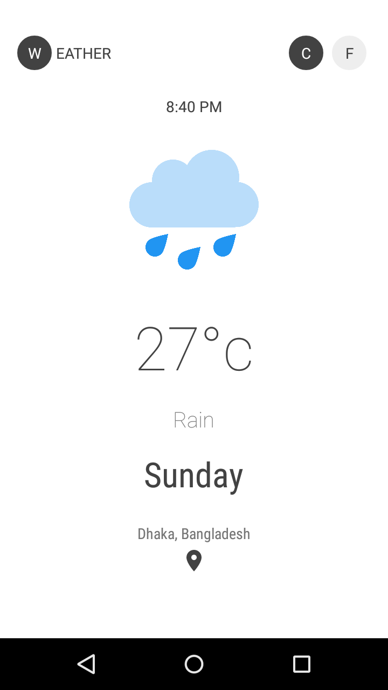
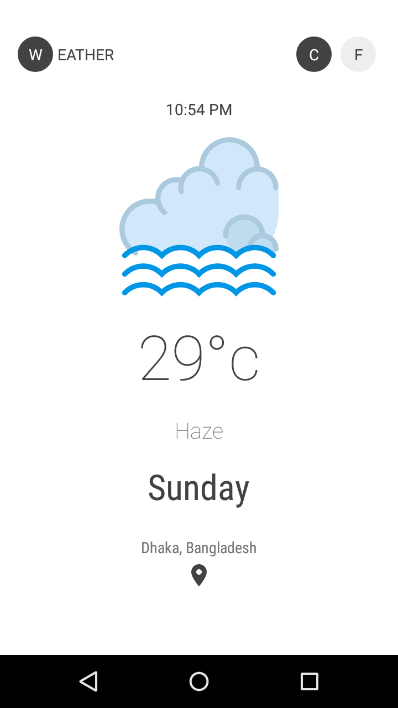
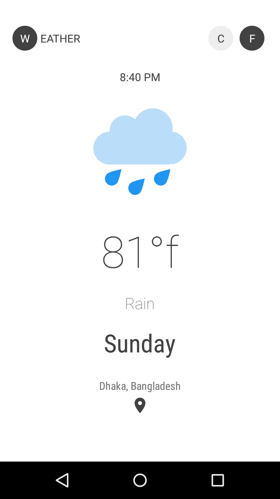

# Weather Android  
  

   
   
   
  
  

  
### Features
  - Weather forecast from open weather map api
  - Celcius/Fahrenheit Conversion
  - Clean and Simple Material Design
  
### Screenshots

  
  
  
  

  
## License

This work is licensed under [GNU General Public License v3.0](https://github.com/atick-faisal/PIC16F877a/blob/master/LICENSE).
